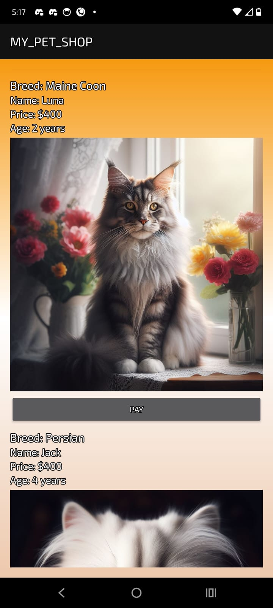

# 🐾 PetBuddy Android App

Welcome to **PetShop**, your ultimate destination to find and adopt your favorite pets right from your mobile device! This Android application is designed to offer a smooth and user-friendly experience for pet lovers.  

---

## ✨ Features

- **User Registration & Login**  
  Secure sign-up and login system to keep your account safe and personalized.  

- **Profile Management**  
  Users can easily update their profile information at any time.  

- **Home Page with Categories**  
  A clean and intuitive home screen showcasing pet categories:
  - 🐶 Dogs
  - 🐱 Cats
  - 🐦 Birds

- **Pet Listings**  
  Each category contains a wide range of pets, complete with images and detailed descriptions to help you find your perfect companion.  

- **Secure Payment Integration**  
  Users can adopt pets through a seamless payment process integrated with **bKash**, ensuring a safe and reliable transaction experience.  

- **Real-time Database**  
  All data is stored and managed using **Firebase**, providing real-time updates and a scalable backend infrastructure.

---

## 🚀 Technologies Used

- **Android Studio (Java/Kotlin)**
- **Firebase Authentication**
- **Firebase Realtime Database**
- **Firebase Storage**
- **Uddokkta Pay Payment Gateway API**

## 📸 Screenshots

